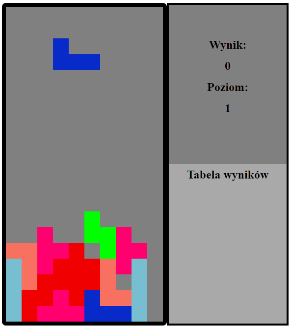

# JS_Tetris
## Classic Tetris game created in JS
A small high school project implementing the classic Tetris game with a leaderboard feature. The leaderboard stores high scores in an SQL database.
## Screenshots

